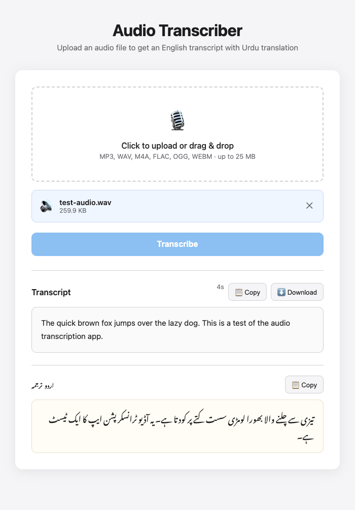

# Audio Transcriber

A lightweight web app that transcribes English audio files and translates the transcript to Urdu — all for free using [Groq](https://groq.com).

## Demo



1. Upload an audio file
2. Get the English transcript
3. See the Urdu translation appear below

## Features

- Drag & drop or click to upload audio
- Supports MP3, WAV, M4A, FLAC, OGG, WEBM (up to 25 MB)
- Audio preview before transcribing
- English transcript via **Groq Whisper** (`whisper-large-v3-turbo`)
- Urdu translation via **Groq LLaMA** (`llama-3.3-70b-versatile`)
- Copy and download transcript buttons

## Setup

### 1. Get a free Groq API key

Go to [console.groq.com](https://console.groq.com) → API Keys → Create a key. No billing required.

### 2. Clone and install

```bash
git clone https://github.com/mmahmad/ibrahim-demo.git
cd ibrahim-demo
npm install
```

### 3. Configure environment

```bash
cp .env.example .env
```

Open `.env` and add your key:

```
GROQ_API_KEY=gsk_...
```

### 4. Run

```bash
npm start
```

Open [http://localhost:3000](http://localhost:3000).

## Tech Stack

| Component | Service |
|---|---|
| Backend | Node.js + Express |
| File upload | Multer |
| Transcription | Groq Whisper (`whisper-large-v3-turbo`) |
| Translation | Groq LLaMA (`llama-3.3-70b-versatile`) |
| Frontend | Vanilla HTML/CSS/JS |
